# Assay — the Conduit Design Language

**One suite. One surface. One current.**

Assay is the unified design language for the entire Conduit suite by
Touchstone Institute — SSO, Dashboard, Campus (LMS), Learning, Exams
(Assessment), CELBAN, PRO, MMI, Connect, Mail, SecureShare, Insights
(Analytics), Payments and Work With Us. It defines one visual and
interaction vocabulary so that a person moves from sign-in, through any
service, to sign-out without ever feeling like they changed products.

A *touchstone* is an assay stone — the fine-grained dark slab once used to
test the quality of precious metal. The name Assay grounds the design
language in the institute's own identity: this is a design system for an
organization whose work is assessment, and its bar is the same — every
screen should hold up under scrutiny.

---

## 1. Design philosophy

Four principles govern every screen in the suite. They favour the calm,
spacious clarity of the best modern productivity software while remaining
unmistakably Touchstone — one confident teal, a deep institutional navy,
and a signature gradient found nowhere else.

1. **Calm surfaces, one confident colour.**
   White cards on a quiet `#F8F9FA` canvas. Colour is spent deliberately:
   teal marks the one primary action and the active place; status hues
   appear only when something needs attention. If everything is loud,
   nothing is.

2. **The shell is the suite.**
   Every service renders inside the identical application shell — deep
   navy navigation rail, white top bar with universal search, the app
   switcher, the same account and sign-out affordance in the same place.
   Services differ in what they say, never in how they say it.

3. **High stakes demand low friction.**
   Conduit users are often candidates on the most important day of their
   professional life. Screens lead with the one thing that matters now
   (the next exam, the join button, the due fee), keep secondary detail
   quiet, and never make someone hunt for help.

4. **Accessible is the default, not a mode.**
   WCAG 2.1 AA contrast is built into the tokens themselves. Focus rings,
   reduced-motion behaviour, screen-reader landmarks, and a full dark
   theme come from the token layer — individual teams cannot forget them.

### What Assay is not

Assay borrows the *discipline* of great minimal design — restraint,
whitespace, a single accent, quiet chrome — but it is not a copy of any
other company's language. Its identity comes from Touchstone's own brand
facts: the CONDUIT wordmark's pulse line, the teal/navy palette, IBM Plex
Sans, and a shape language (20 px cards, 10 px controls) that is softer
than Material's defaults and squarer than consumer-app pills.

---

## 2. The signature motif — the Current

The CONDUIT wordmark carries a pulse line that flows from deep indigo
through teal into green. Assay elevates that line into the suite's one
ownable graphic device, **the Current**:

```css
--a-current: linear-gradient(90deg, #232D63 0%, #0281A0 55%, #93C13E 100%);
```

Where it appears — and nowhere else:

| Use | Form |
|---|---|
| Page identity | 56×3 px bar under every page title |
| Active navigation | 3 px vertical slice beside the active rail item |
| Selected tab | 3 px underline |
| Progress | fill of every progress bar |
| Brand mark | the pulse line inside the rounded-square app mark |

Because the Current is reserved for these five uses, it stays special: a
thin thread of the brand running through every service — literally the
conduit.

---

## 3. Foundations

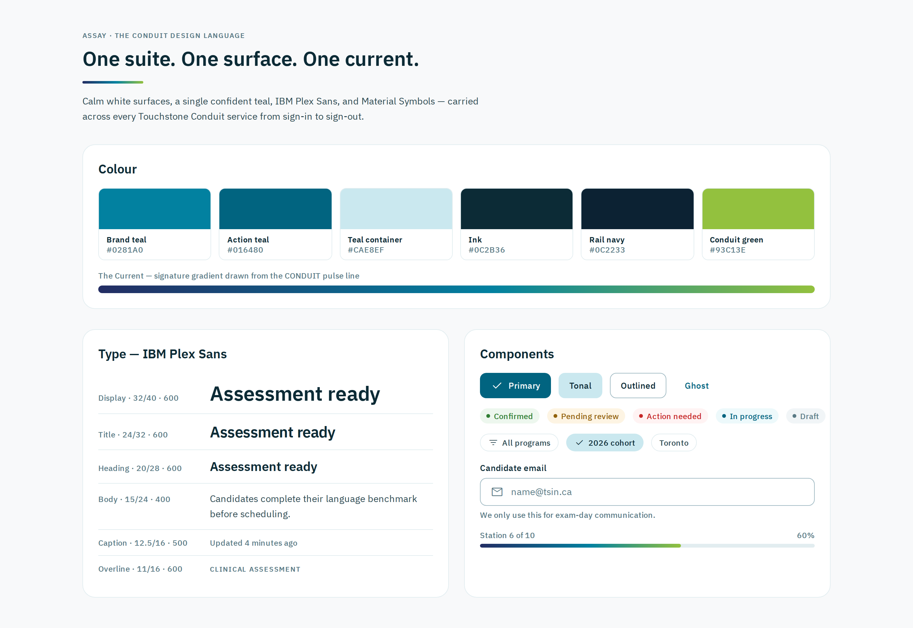

### 3.1 Colour

Drawn from the Touchstone Conduit brand specification. All text/surface
pairs meet WCAG 2.1 AA; `#016480` is used for filled buttons because it
reaches 6.7:1 on white.

| Token | Light | Dark | Role |
|---|---|---|---|
| `--a-teal` | `#0281A0` | `#38B2CC` | brand, links, focus, active |
| `--a-teal-action` | `#016480` | `#2598B8` | filled buttons |
| `--a-teal-deep` | `#014F65` | `#1E85A0` | hover/pressed |
| `--a-teal-light` | `#CAE8EF` | `#164E63` | containers, selection |
| `--a-teal-wash` | `#EDF9FB` | `#12303E` | tinted wash, hover rows |
| `--a-ink` | `#0C2B36` | `#F0F9FF` | headings |
| `--a-ink-body` | `#2E4A52` | `#CBD5E1` | body text |
| `--a-ink-muted` | `#5A7A85` | `#94A3B8` | captions, meta |
| `--a-bg` | `#F8F9FA` | `#111827` | app canvas |
| `--a-surface` | `#FFFFFF` | `#1E2A38` | cards, sheets |
| `--a-rail` | `#0C2233` | `#0A1628` | navigation rail |
| `--a-border` | `#9FB9C2` | `#334155` | interactive outlines |
| `--a-border-subtle` | `#E2EDF0` | `#263347` | hairlines, dividers |
| `--a-success` | `#2E7D32` | `#86EFAC` | positive status |
| `--a-warning` | `#92610A` | `#FBD38D` | caution status |
| `--a-error` | `#C62828` | `#FCA5A5` | errors, destructive |

**Dark theme** ships in the same token file. It activates on
`prefers-color-scheme: dark` automatically, or explicitly via
`<html data-theme="dark">`; `data-theme="light"` pins light. Product code
never branches on theme — it only ever reads tokens.

**Data-visualisation palette.** Charts use a fixed six-colour categorical
order — teal `#0281A0`, amber `#E8A33D`, indigo `#4A5AC9`, green
`#93C13E`, plum `#9C5FB5`, rust `#B4552D` (with darker dark-mode
counterparts in the token file). The order was machine-validated for
colour-vision-deficiency separation, chroma, and lightness band; series
are assigned in this order and never cycled. Amber and green sit below
3:1 contrast on white, so any chart using them must carry direct labels
or a table view — the mockups model both.

### 3.2 Typography — IBM Plex Sans

Self-hosted (OFL), three weights only: 400, 500, 600. One family across
every service; `IBM Plex Mono` is reserved for code and identifiers.

| Style | Spec | Use |
|---|---|---|
| Display | 32/40 · 600 | greeting, hero numbers |
| Title | 24/32 · 600 | page titles |
| Heading | 20/28 · 600 | card/section titles |
| Subhead | 16/24 · 600 | list headings, emphasis |
| Body | 15/24 · 400 | default text |
| Body-sm | 13.5/20 · 400 | dense UI, tables |
| Caption | 12.5/16 · 500 | meta, timestamps |
| Overline | 11/16 · 600 · caps · +0.08em | eyebrow labels |

### 3.3 Iconography

**Material Symbols Outlined** is the only icon family in the suite,
self-hosted as a single variable-weight woff2 and rendered by ligature.
Default optical size 24 px; 20 px inside buttons and dense rows. Icons are
always paired with a visible label or an `aria-label` — never
meaning-by-icon-alone.

### 3.4 Space, shape, elevation, motion

- **Spacing:** strict 8-pt rhythm — `4, 8, 12, 16, 24, 32, 48, 64`.
- **Shape:** cards 20 px, chips 14 px, inputs and buttons 10 px, pills 999 px.
  This soft-square shape family is a deliberate Assay signature.
- **Elevation:** three shadows only (`sm`, `md`, `lg`); the `md` card
  shadow is teal-tinted (`rgba(2,129,160,.08)`) so depth carries brand.
- **Motion:** 120/200/320 ms, one decelerate curve
  `cubic-bezier(0.2, 0, 0, 1)`; every animation collapses under
  `prefers-reduced-motion`.

---

## 4. The unified shell

The heart of the "login → service → logout" continuity. All fourteen
services render this exact structure:

```
┌──────────┬──────────────────────────────────────────────┐
│          │  top bar: page context · universal search ·  │
│   rail   │  help · notifications · app switcher · avatar│
│  (navy)  ├──────────────────────────────────────────────┤
│          │                                              │
│ CONDUIT  │   content canvas (max 1280 px, 24 px gutters)│
│ +service │   page title + Current bar                   │
│  nav…    │   cards / tables / lists from the toolkit    │
│          │                                              │
│ apps     │   ─────────────────────────────────────────  │
│ settings │   footer: © Touchstone Institute · links     │
└──────────┴──────────────────────────────────────────────┘
```

Fixed contract, identical in every service:

- **Rail** (248 px, `#0C2233`): CONDUIT mark + current service name at the
  top; service navigation; then always — "All Conduit apps" and
  "Settings" pinned to the bottom. Active item gets a `--a-rail-active`
  fill plus a vertical slice of the Current. Identity and sign-out live
  in the top bar's account menu, not the rail.
- **Top bar** (64 px, white): page context on the left, the universal
  search field in the centre (`/` focuses it in every service), then
  help, notifications, the nine-dot **app switcher**, and the avatar.
- **Account menu**: clicking the avatar opens a dropdown with the
  signed-in identity (name, role, email), "My profile", "Account
  settings", and **"Sign out of Conduit"** — the suite's one sign-out,
  in the same place on every screen.
- **Footer**: every service page ends with the shared footer — © 2026
  Touchstone Institute plus Privacy, Accessibility, Terms of use and
  Français links. It pins to the bottom of short pages and follows the
  content on long ones.
- **App switcher**: the same grid of Conduit services from everywhere —
  the suite's connective tissue. One click moves between services; SSO
  makes the transition silent.
- **Responsive**: below 1100 px side panels stack; below 900 px the rail
  collapses to 72 px (icons + tooltips); on mobile it becomes a drawer
  behind a top-bar menu button. Grids collapse to one column at 720 px.

**Sign-in and sign-out are part of the system.** The journey begins on the
shared SSO surface (below) and every service ends the same way: the
avatar's account menu, "Sign out of Conduit", and the SSO sign-out
confirmation. Same door in, same door out.

---

## 5. The component toolkit

Two CSS files, framework-agnostic, consumable by every Angular frontend
in the suite (and anything else):

```
design-system/
├── tokens/conduit-tokens.css    ← layer 1: all tokens + fonts + dark theme
├── toolkit/conduit-ui.css       ← layer 2: the a-* component vocabulary
└── fonts/                       ← IBM Plex Sans + Material Symbols (self-hosted)
```

The vocabulary (`a-` prefix): shell (`a-shell`, `a-rail`, `a-topbar`,
`a-main`), page scaffolding (`a-page-head`, `a-breadcrumbs`, `a-tabs`,
`a-current-bar`), containers (`a-card`, `a-stat`, grid helpers), actions
(`a-btn` filled/tonal/outlined/ghost/danger in 3 sizes, `a-icon-btn`),
forms (`a-field`, `a-input` with leading icons and error states), data
(`a-table`, `a-list`, `a-progress`, `a-badge`, `a-chip`), communication
(`a-banner` info/success/warning/error, `a-empty`), identity (`a-avatar`,
`a-mark`), and the auth surface (`a-auth`, `a-auth__card`).

Component rules that keep the suite coherent:

- **One primary action per view**, always `a-btn--filled` in action teal.
- **Status is a badge, never coloured text alone** — every badge carries a
  dot and a word; icons or text accompany colour everywhere.
- **Tables and lists share the same hover** (`--a-teal-wash`) and row
  anatomy in every service.
- **Empty states teach**: icon, one-line explanation, one action.
- **Focus is always visible**: 2 px teal outline, 3 px offset, everywhere.

### Angular Material interop

Services built on Angular Material 3 adopt Assay without rewriting
components: load the two CSS files, then map M3 system tokens to Assay
tokens (`--mat-sys-primary: var(--a-teal)`, surfaces, outlines, error,
typography to IBM Plex Sans, `--mdc-outlined-text-field-container-shape:
var(--a-radius-input)`, and so on). The SSO frontend already demonstrates
this token-override pattern; the shared file gives all fourteen services
the same values from one place.

---

## 6. The suite, screen by screen

Fourteen sample screens, one per service, all built purely from the
toolkit above. Every screenshot below is generated from the HTML in
[`mockups/`](mockups/) by [`tools/screenshot.mjs`](tools/screenshot.mjs)
— the mockups are living proof that the toolkit covers real product
surfaces, not just a style board.

### 6.1 SSO — the front door

The split auth surface: brand panel on rail navy carrying the official
CONDUIT wordmark (with its gradient pulse line) and a hint of the suite
behind the door; the sign-in card on the right with 52 px fields, social
sign-in, and the "Continue to *service*" context line so users always
know where SSO will take them. Bilingual footer (EN/Français), privacy
and accessibility links. The wordmark assets are shipped in
[`brand/`](brand/).

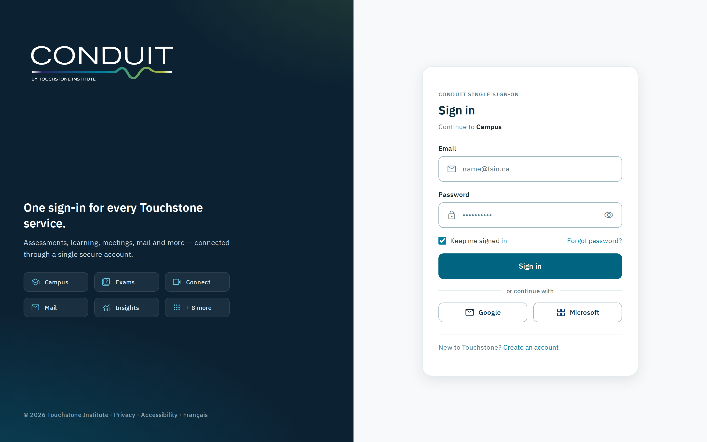

### 6.2 Dashboard — the suite home

The landing surface after sign-in: greeting, the app grid (every tile one
click from anywhere via the same switcher), "continue where you left
off" drawing from all services, tasks and announcements. Shown with the
account menu open — identity, profile, settings and "Sign out of
Conduit" behind the avatar, identical in every service.

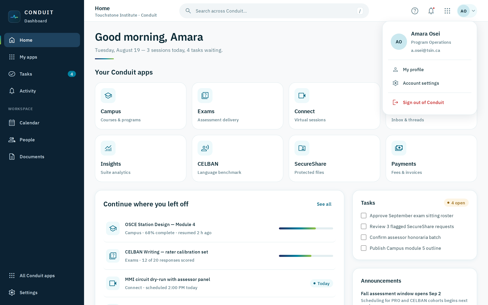

The same page in dark mode — zero product-code changes, tokens only:

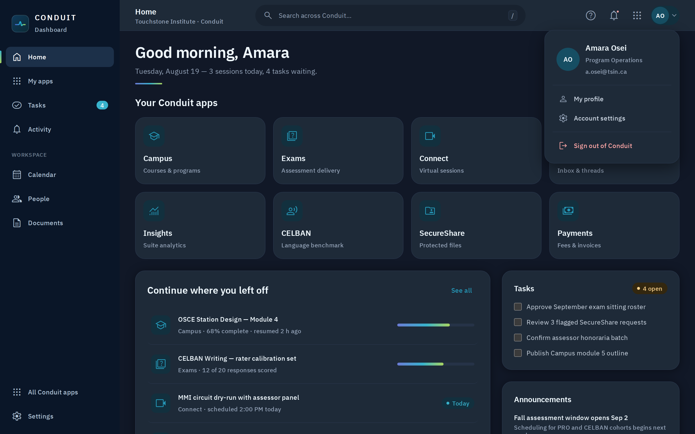

### 6.3 Campus (LMS) — course detail

Breadcrumbs, tabs with the Current underline, module list with
locked/current/complete states, progress panel, "up next" and a cohort
notice banner.

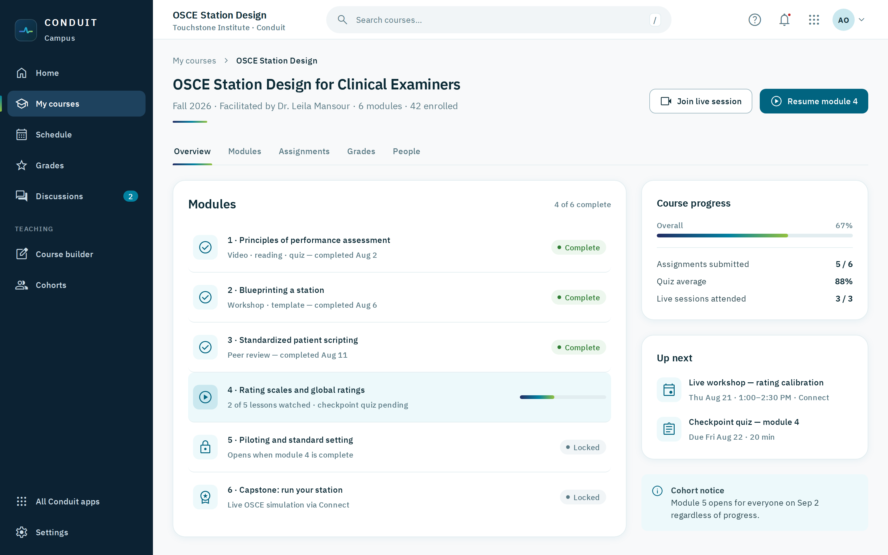

### 6.4 Learning — my learning

Course cards with gradient banners and floating icon chips, Current-fill
progress, filter chips, and a pathway-aware recommendation list.

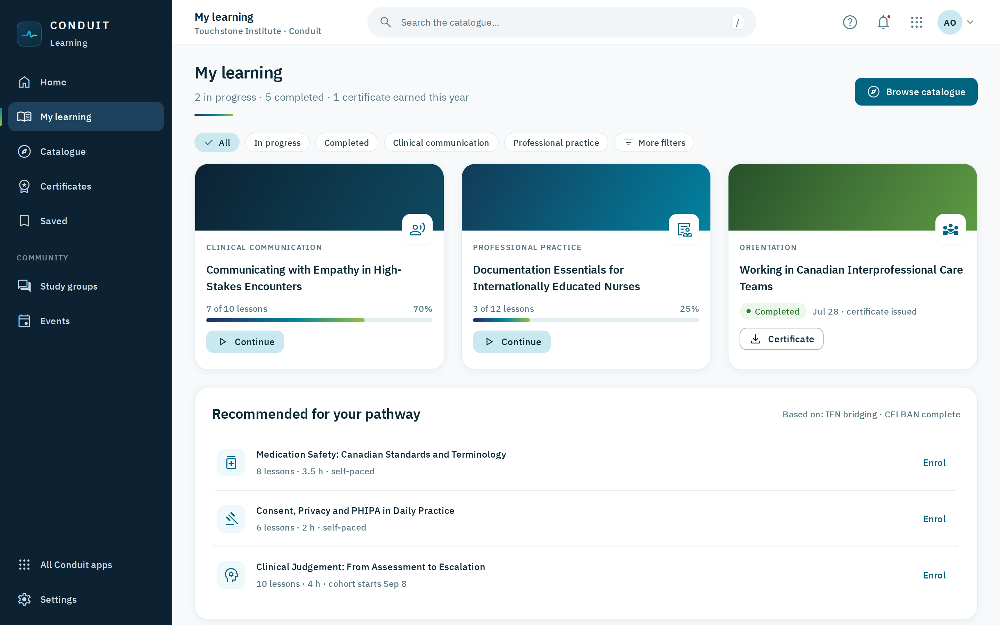

### 6.5 Exams (Assessment) — candidate home

The countdown hero leads with the one thing that matters (9 days to go),
followed by logistics, admission letter, results table with score
reports, exam-day checklist and a reschedule-deadline warning.

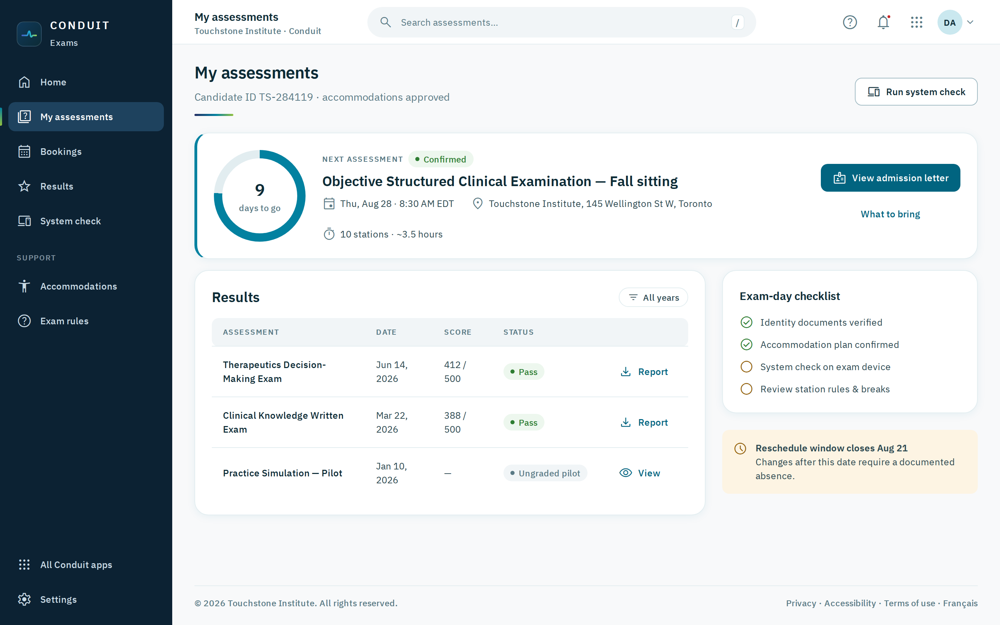

### 6.6 CELBAN — applicant portal

The six-step registration journey as a stepper, bookable sessions with
seat counts, CLB band scores from the previous attempt, document
verification status and prep material.

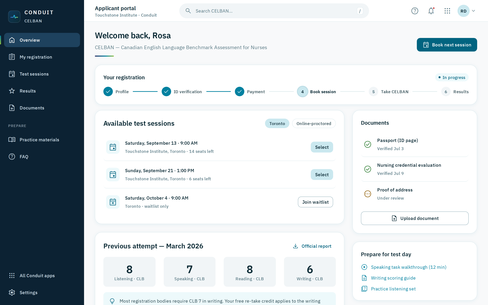

### 6.7 PRO — candidate journey

Stat row (weeks, field notes, evaluations, outstanding items), the
assessment timeline from eligibility to independent practice, evaluations
and the program team with direct messaging.

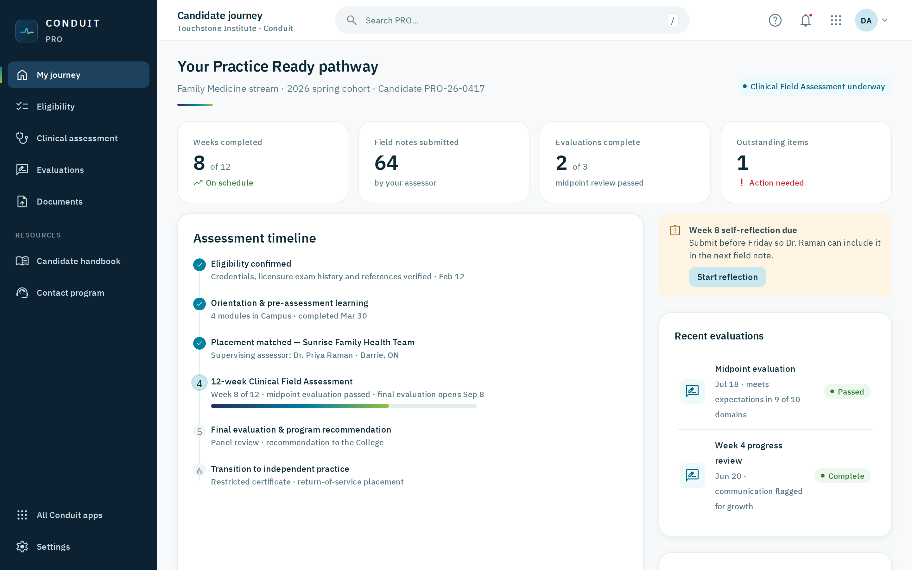

### 6.8 MMI — interview day

The live station: video stage on rail navy with recording badge, timer
and call controls; the prompt below; circuit progress with completed /
current / upcoming stations; one-click proctor help.

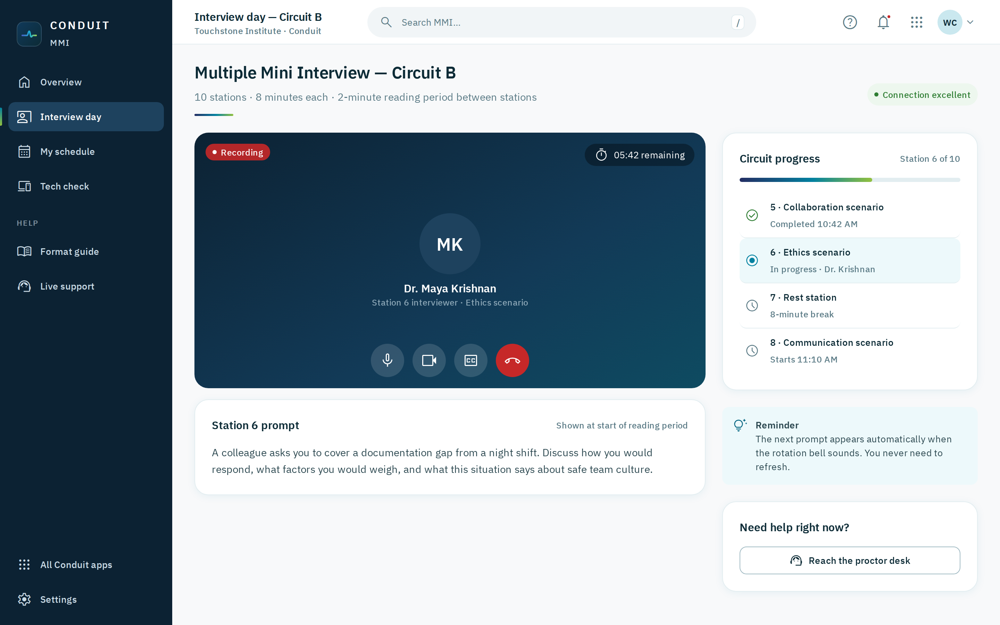

### 6.9 Connect — sessions

Three quick actions (start / schedule / join by code), upcoming sessions
with LTI-vs-standalone badges showing Campus integration, recordings with
transcripts, and the attendance-passback notice.

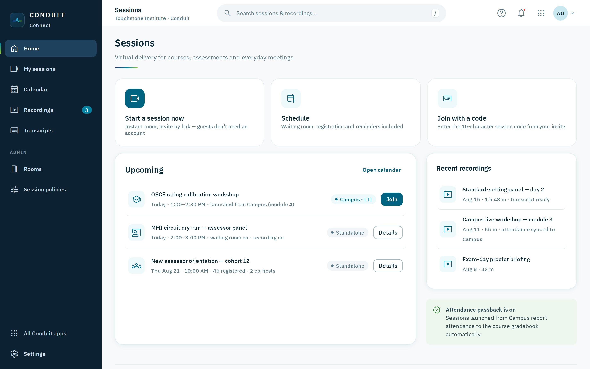

### 6.10 Mail — inbox

The shell flexing: rail becomes mailbox navigation (compose, inbox,
labels), content splits into list + reading pane, with the same avatars,
chips and buttons as everywhere else.

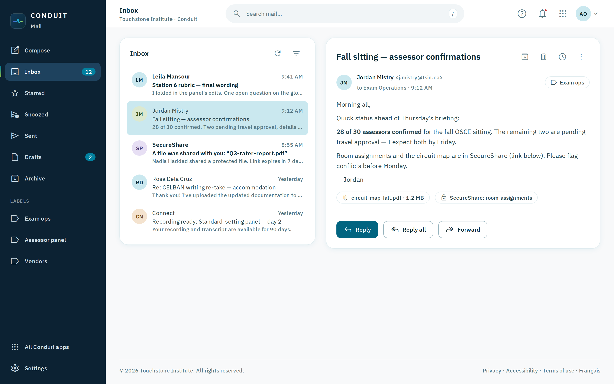

### 6.11 SecureShare — protected files

Trust made visible: protected-workspace banner, per-file access levels
and expiry, approval-pending flow, and a live access log including a
blocked forwarded-link event.

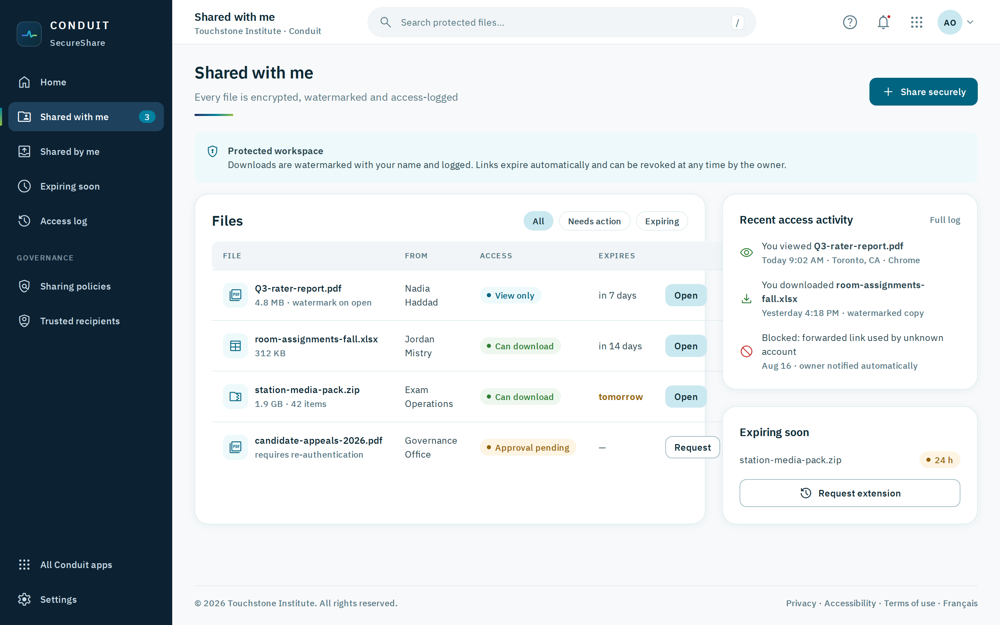

### 6.12 Insights (Analytics) — suite overview

KPI stat tiles, a two-series line chart and a labelled bar breakdown in
the validated viz palette, an alert, and the service-health table (every
chart's data is also available as a table).

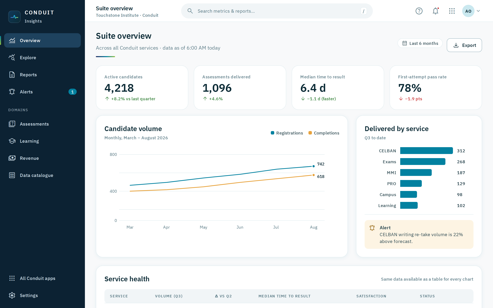

### 6.13 Payments — billing & receipts

The due-now invoice leads with amount and one primary action; history
with receipts, payment methods, year summary and the PCI reassurance
note.

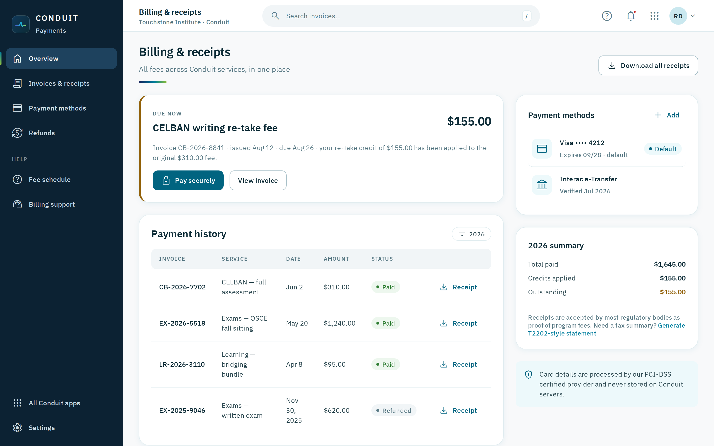

### 6.14 Work With Us — opportunities

Role cards with program eyebrows and closing dates, filter chips,
application status, and credential/training status that links back into
Campus — the suite referring to itself.

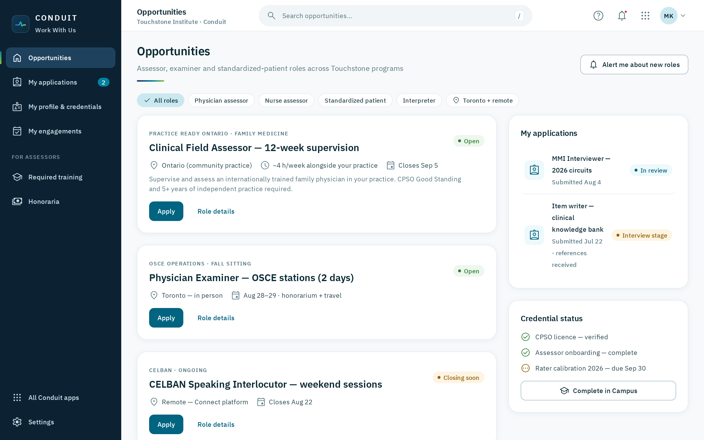

---

## 7. Interaction patterns

- **Universal search**: `/` focuses search in every service; results are
  scoped to the service with a "search all of Conduit" escape hatch.
- **Status vocabulary** (suite-wide, fixed): green = confirmed/complete,
  amber = waiting/closing, red = action needed/blocked, teal = in
  progress/informational, grey = draft/locked. A status never appears as
  colour alone.
- **Notifications** live in one place (the bell) with service-tagged
  entries; destructive actions confirm and name their object.
- **Cross-service handoffs** are badges, not surprises: "Campus · LTI" on
  a Connect session, a SecureShare chip in Mail, "Complete in Campus" in
  Work With Us. The suite advertises its own connective tissue.
- **Keyboard**: full tab order rail → top bar → content; visible focus at
  every stop; `Esc` closes overlays.

## 8. Accessibility checklist (per screen)

- Text contrast ≥ 4.5:1, large text and UI outlines ≥ 3:1 (tokens
  guarantee this; `--a-border` was chosen specifically to pass 1.4.11).
- Landmarks: `nav` (rail), `header` (top bar), `main` (canvas).
- `aria-current="page"` on active nav; labelled icon buttons; `sr-only`
  helpers where visual context carries meaning.
- Charts: direct labels or table equivalent; never colour-only series.
- Reduced motion honoured globally; dark theme honours OS preference.
- Both official languages: all shell strings ship EN + FR-CA.

## 9. Adoption path for service teams

1. Add `design-system/tokens/conduit-tokens.css` +
   `design-system/toolkit/conduit-ui.css` (and the `fonts/` folder) to
   the frontend build — published as a shared package or vendored.
2. Map Angular Material system tokens to Assay tokens (§5) and delete
   local font-face/palette declarations.
3. Replace the app frame with the Assay shell (rail + top bar contract in
   §4), keeping service-specific navigation items.
4. Sweep screens to toolkit components — page head with Current bar,
   cards, badges, banners, tables.
5. Verify with the checklist in §8 and screenshot against the reference
   mockups in `mockups/`.

New surfaces should be composed in mockup form first (copy any file in
`mockups/`, build from toolkit classes, screenshot with
`node tools/screenshot.mjs <file>`), then implemented.

## 10. Governance

- The token files in this folder are the **single source of truth**;
  services never hard-code colour, type, radius, shadow or spacing.
- Changes to tokens or shell anatomy are proposed here (tsinconduit-SSO)
  and reviewed for contrast, dark-mode parity and cross-service impact
  before any service adopts them.
- The Current stays reserved for its five uses (§2). When everything
  glows, nothing does.
